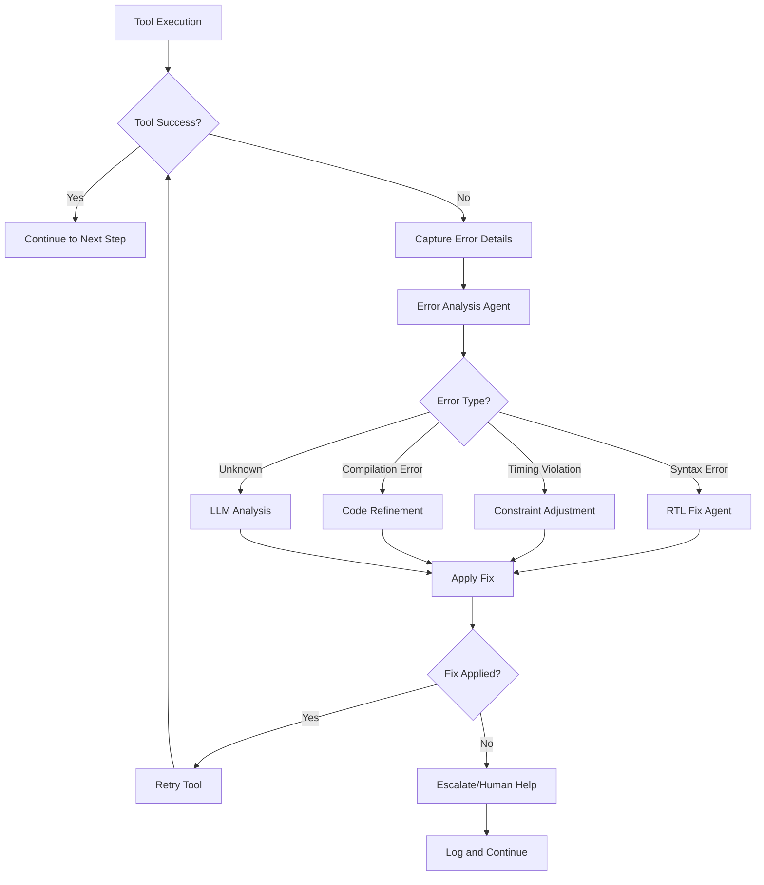

# ASU Spec2Tapeout ICLAD 2025 Agent Architecture Plan

## Overview
This plan outlines the development of an intelligent **multi-agent system** that automatically generates tapeout-ready ASIC designs from YAML specifications. The architecture follows agent design principles with a central planning layer and specialized sub-agents.

## Agent Architecture Overview

```
Central Planning Agent (your_agent.py - minimal changes)
├── Specification Analysis Agent
├── RTL Generation Agent  
├── Verification Agent
├── Constraint Generation Agent
├── Physical Design Agent
└── Results Validation Agent
```

## Phase 1: Core Agent Architecture Design

### 1.1 Available EDA Tools in Docker Environment
**Available Tools**:
- **Synthesis**: Yosys (v0.53), ABC, yosys-smtbmc
- **Simulation**: Icarus Verilog (v11.0), Verilator (v5.026), GTKWave
- **Physical Design**: OpenROAD, STA (v2.7.0)
- **Layout**: KLayout (v0.28.17)  
- **PDKs**: Sky130 (HD/HS/IO/RAM), ASAP7, Nangate45, GF180, IHP-SG13G2
- **Programming**: Python 3.10 with NumPy

### 1.2 Agent System Architecture

**Central Planning Agent** (`your_agent.py` - Keep Minimal):
- Problem routing and orchestration
- High-level flow control
- Sub-agent coordination
- Results aggregation

**Specialized Sub-Agents** (New Files):
- `agents/spec_analyzer.py` - YAML specification analysis
- `agents/rtl_generator.py` - LLM-based RTL generation  
- `agents/verification_agent.py` - Functional verification
- `agents/constraint_generator.py` - SDC generation
- `agents/physical_designer.py` - OpenROAD flow management
- `agents/validator.py` - Quality assessment

**Tool Wrappers** (New Files):
- `tools/eda_tools.py` - EDA tool interfaces
- `tools/llm_interface.py` - LLM communication
- `tools/file_manager.py` - File I/O operations

### 1.3 Implementation Strategy for your_agent.py TODOs

**Current TODOs in your_agent.py**:
1. `generate_rtl()` → Route to RTL Generation Agent
2. `verify_rtl_functionality()` → Route to Verification Agent  
3. `run_openroad_flow()` → Route to Physical Design Agent
4. `generate_sdc_constraints()` → Route to Constraint Generation Agent

**New your_agent.py Structure**:
```python
class ASUTapeoutAgent:
    def __init__(self):
        self.spec_analyzer = SpecAnalyzer()
        self.rtl_generator = RTLGenerator() 
        self.verification_agent = VerificationAgent()
        self.constraint_generator = ConstraintGenerator()
        self.physical_designer = PhysicalDesigner()
        self.validator = Validator()
    
    def solve_problem(self, yaml_file, output_dir):
        # Planning layer - orchestrate sub-agents
        plan = self.create_execution_plan(yaml_file)
        return self.execute_plan(plan, output_dir)
```

## Phase 2: LangChain/LangGraph Agent Architecture

### 2.1 LangGraph State Management

**File**: `agents/state.py`

**Tool Calls Required**:
- `edit_file`: Create state management with Pydantic models
- `read_file`: Study LangGraph state patterns

**State Definition**:
```python
from typing import Annotated, List, Tuple, Optional, Union
from typing_extensions import TypedDict
from pydantic import BaseModel, Field
import operator

class PlanStep(BaseModel):
    """Individual step in the execution plan"""
    step: str = Field(description="Description of the step to execute")
    agent: str = Field(description="Which agent should execute this step")
    dependencies: List[str] = Field(default=[], description="Previous steps this depends on")
    status: str = Field(default="pending", description="pending/running/completed/failed")

class DesignPlan(BaseModel):
    """Overall plan for the tapeout flow"""
    steps: List[PlanStep] = Field(description="Ordered list of steps to execute")
    current_step: int = Field(default=0, description="Index of current step")
    
class TapeoutState(TypedDict):
    """Main state for the ASU Tapeout Agent"""
    input: str                                          # Original YAML file path
    problem_spec: dict                                  # Parsed YAML specification
    plan: DesignPlan                                   # Execution plan
    past_steps: Annotated[List[Tuple], operator.add]  # Completed steps with results
    rtl_code: Optional[str]                            # Generated RTL
    sdc_constraints: Optional[str]                     # Generated SDC
    verification_results: Optional[dict]               # Verification outcomes
    physical_results: Optional[dict]                   # OpenROAD results
    final_response: Optional[str]                      # Final output path
    errors: Annotated[List[str], operator.add]        # Accumulated errors
    metrics: Optional[dict]                            # Quality metrics
```

### 2.2 Plan-and-Execute Pattern for EDA

**File**: `agents/planning_agent.py`

**LangGraph Planning Implementation**:
```python
from langchain_core.prompts import ChatPromptTemplate
from langchain_openai import ChatOpenAI
from pydantic import BaseModel, Field

class EDAExecutionPlan(BaseModel):
    """Plan for EDA tapeout flow execution"""
    steps: List[str] = Field(
        description="Ordered steps for RTL-to-GDSII flow, should include: "
                   "spec_analysis, rtl_generation, verification, constraint_generation, "
                   "physical_design, validation"
    )
    estimated_complexity: str = Field(
        description="low/medium/high complexity assessment"
    )
    recommended_tools: List[str] = Field(
        description="Specific EDA tools recommended for this design"
    )

planner_prompt = ChatPromptTemplate.from_messages([
    ("system", """You are an expert EDA planning agent. Given a YAML specification for an ASIC design, 
    create a detailed execution plan for the complete RTL-to-GDSII flow.
    
    Consider:
    - Design complexity (combinational vs sequential logic)
    - Timing requirements and clock periods
    - Verification needs based on functionality
    - Physical design constraints
    - Tool selection (Icarus Verilog, Yosys, OpenROAD)
    
    Always include these phases: spec_analysis, rtl_generation, verification, 
    constraint_generation, physical_design, validation"""),
    ("user", "Design specification:\n{spec}\n\nCreate execution plan:")
])

class PlanningAgent:
    def __init__(self, llm_model="gpt-4o"):
        self.llm = ChatOpenAI(model=llm_model, temperature=0)
        self.planner = planner_prompt | self.llm.with_structured_output(EDAExecutionPlan)
    
    async def create_plan(self, state: TapeoutState) -> dict:
        """Create initial execution plan"""
        plan = await self.planner.ainvoke({"spec": state["problem_spec"]})
        
        # Convert to PlanStep objects
        plan_steps = [
            PlanStep(step=step, agent=self._get_agent_for_step(step))
            for step in plan.steps
        ]
        
        return {
            "plan": DesignPlan(steps=plan_steps),
            "past_steps": [("planning", f"Created plan with {len(plan_steps)} steps")]
        }
    
    def _get_agent_for_step(self, step: str) -> str:
        """Route steps to appropriate agents"""
        routing = {
            "spec_analysis": "spec_analyzer",
            "rtl_generation": "rtl_generator", 
            "verification": "verification_agent",
            "constraint_generation": "constraint_generator",
            "physical_design": "physical_designer",
            "validation": "validator"
        }
        return routing.get(step, "generic_agent")
```

### 2.3 ReAct Agent Pattern for Sub-Agents

**File**: `agents/rtl_generator.py`

**LangGraph ReAct Implementation**:
```python
from langgraph.prebuilt import create_react_agent, ToolNode
from langchain_core.tools import tool
from typing import Annotated

@tool
def validate_rtl_syntax(rtl_code: str) -> str:
    """Validate RTL syntax using Verilator"""
    # Implementation using subprocess to call Verilator
    pass

@tool 
def generate_testbench(spec: dict) -> str:
    """Generate basic testbench from specification"""
    pass

@tool
def compile_rtl(rtl_file: str, testbench_file: str) -> dict:
    """Compile RTL with Icarus Verilog"""
    pass

class RTLGenerationAgent:
    def __init__(self, llm_model="gpt-4o"):
        self.tools = [validate_rtl_syntax, generate_testbench, compile_rtl]
        self.agent = create_react_agent(
            model=ChatOpenAI(model=llm_model),
            tools=self.tools,
            prompt="""You are an expert RTL generation agent. 
            
            Your goal is to generate high-quality, synthesizable SystemVerilog RTL 
            from YAML specifications. 
            
            Always:
            1. Analyze the specification thoroughly
            2. Generate RTL following the exact module signature
            3. Validate syntax with tools
            4. Test compilation
            5. Iterate if needed
            
            Use the available tools to validate your work."""
        )
    
    async def generate_rtl(self, state: TapeoutState) -> dict:
        """Generate RTL using ReAct pattern"""
        spec = state["problem_spec"]
        problem_name = list(spec.keys())[0]
        
        # Create task description for the agent
        task = f"""Generate SystemVerilog RTL for: {problem_name}
        
        Specification:
        {spec[problem_name]}
        
        Requirements:
        - Follow exact module signature
        - Implement all described functionality  
        - Ensure synthesizable code
        - Validate with tools
        """
        
        # Run ReAct agent
        result = await self.agent.ainvoke({"messages": [("user", task)]})
        
        # Extract RTL from agent response
        rtl_code = self._extract_rtl_from_response(result["messages"][-1].content)
        
        return {
            "rtl_code": rtl_code,
            "past_steps": [(f"rtl_generation", "Generated and validated RTL")]
        }
```

### 2.4 StateGraph Implementation

**File**: `agents/tapeout_graph.py`

**Complete LangGraph Implementation**:
```python
from langgraph.graph import StateGraph, START, END
from langgraph.checkpoint.memory import MemorySaver
from langgraph.prebuilt import tools_condition
from typing import Literal

class TapeoutGraph:
    def __init__(self):
        self.graph = StateGraph(TapeoutState)
        self.setup_nodes()
        self.setup_edges()
        
    def setup_nodes(self):
        """Add all agent nodes to the graph"""
        # Planning and coordination
        self.graph.add_node("planner", self.plan_step)
        self.graph.add_node("replan", self.replan_step)
        
        # Specialized agents
        self.graph.add_node("spec_analyzer", self.analyze_spec)
        self.graph.add_node("rtl_generator", self.generate_rtl)
        self.graph.add_node("verification_agent", self.verify_rtl)
        self.graph.add_node("constraint_generator", self.generate_constraints)
        self.graph.add_node("physical_designer", self.run_physical_design)
        self.graph.add_node("validator", self.validate_results)
        
    def setup_edges(self):
        """Define the execution flow"""
        # Start with planning
        self.graph.add_edge(START, "planner")
        
        # From planner, route to appropriate agent
        self.graph.add_conditional_edges(
            "planner",
            self.route_to_next_step,
            {
                "spec_analyzer": "spec_analyzer",
                "rtl_generator": "rtl_generator", 
                "verification_agent": "verification_agent",
                "constraint_generator": "constraint_generator",
                "physical_designer": "physical_designer",
                "validator": "validator",
                END: END
            }
        )
        
        # All agents go to replan for next step
        for agent in ["spec_analyzer", "rtl_generator", "verification_agent", 
                     "constraint_generator", "physical_designer"]:
            self.graph.add_edge(agent, "replan")
            
        # Replan routes to next step or end
        self.graph.add_conditional_edges(
            "replan",
            self.route_to_next_step,
            {
                "spec_analyzer": "spec_analyzer",
                "rtl_generator": "rtl_generator",
                "verification_agent": "verification_agent", 
                "constraint_generator": "constraint_generator",
                "physical_designer": "physical_designer",
                "validator": "validator",
                END: END
            }
        )
        
        # Validator always ends
        self.graph.add_edge("validator", END)
    
    def route_to_next_step(self, state: TapeoutState) -> str:
        """Route to the next step in the plan"""
        plan = state.get("plan")
        if not plan or plan.current_step >= len(plan.steps):
            return END
            
        current_step = plan.steps[plan.current_step]
        if current_step.status == "completed":
            # Move to next step
            plan.current_step += 1
            if plan.current_step >= len(plan.steps):
                return END
            return plan.steps[plan.current_step].agent
        else:
            return current_step.agent
    
    async def plan_step(self, state: TapeoutState) -> dict:
        """Initial planning step"""
        planner = PlanningAgent()
        return await planner.create_plan(state)
        
    async def replan_step(self, state: TapeoutState) -> dict:
        """Replan based on current progress"""
        plan = state["plan"]
        current_step = plan.current_step
        
        if current_step < len(plan.steps):
            plan.steps[current_step].status = "completed"
            plan.current_step += 1
            
        return {
            "plan": plan,
            "past_steps": [("replan", f"Completed step {current_step}, moving to next")]
        }
    
    def compile(self):
        """Compile the graph with checkpointing"""
        checkpointer = MemorySaver()
        return self.graph.compile(checkpointer=checkpointer)
```

### 2.5 Autonomous and Human-in-the-Loop Modes

**File**: `agents/human_validation.py`

**Dual Mode Implementation - Autonomous and Human-in-the-Loop**:
```python
from langgraph.prebuilt import HumanInterrupt, HumanInterruptConfig, ActionRequest
from enum import Enum
from typing import Optional

class ExecutionMode(Enum):
    """Execution modes for the agent"""
    AUTONOMOUS = "autonomous"      # Fully automatic, no human intervention
    HUMAN_IN_LOOP = "human_in_loop"  # Human review for critical decisions
    HUMAN_APPROVAL = "human_approval"  # Human must approve all major steps

class ValidationAgent:
    def __init__(self, mode: ExecutionMode = ExecutionMode.AUTONOMOUS):
        """Initialize with specified execution mode
        
        Args:
            mode: Execution mode (autonomous, human_in_loop, or human_approval)
        """
        self.mode = mode
        self.interrupt_config = HumanInterruptConfig(
            allow_ignore=True,     # Can skip validation
            allow_respond=True,    # Can provide feedback  
            allow_edit=True,       # Can edit RTL/constraints
            allow_accept=True      # Can approve as-is
        )
        
        # Confidence thresholds for autonomous decisions
        self.confidence_thresholds = {
            "rtl_generation": 0.85,      # Require 85% confidence for autonomous RTL
            "verification": 0.90,        # 90% for verification pass
            "timing_closure": 0.80,      # 80% for timing acceptance
            "final_validation": 0.95     # 95% for final design approval
        }
    
    async def validate_rtl(self, state: TapeoutState) -> dict:
        """Validate RTL with mode-appropriate review"""
        rtl_code = state["rtl_code"]
        spec = state["problem_spec"]
        
        # Always run automatic validation first
        validation_results = self._run_automatic_validation(rtl_code, spec)
        confidence_score = validation_results.get("confidence", 0.0)
        
        # Decide based on mode
        if self.mode == ExecutionMode.AUTONOMOUS:
            # Fully autonomous - make decisions based on confidence
            if confidence_score >= self.confidence_thresholds["rtl_generation"]:
                return {
                    "past_steps": [("validation", f"RTL auto-approved (confidence: {confidence_score:.2f})")]
                }
            else:
                # Low confidence - try to auto-fix
                fix_result = await self._attempt_auto_fix(state, validation_results)
                return fix_result
                
        elif self.mode == ExecutionMode.HUMAN_IN_LOOP:
            # Human review only for low confidence or critical issues
            if confidence_score < self.confidence_thresholds["rtl_generation"] or validation_results.get("critical_issues"):
                return await self._request_human_review(rtl_code, validation_results, spec)
            else:
                return {
                    "past_steps": [("validation", f"RTL auto-approved (confidence: {confidence_score:.2f})")]
                }
                
        elif self.mode == ExecutionMode.HUMAN_APPROVAL:
            # Always require human approval
            return await self._request_human_review(rtl_code, validation_results, spec)
            
        return {"past_steps": [("validation", "RTL validation completed")]}
    
    async def _attempt_auto_fix(self, state: TapeoutState, validation_results: dict) -> dict:
        """Attempt automatic fixes for common issues"""
        issues = validation_results.get("issues", [])
        rtl_code = state.get("rtl_code", "")
        
        # Use LLM to suggest and apply fixes
        fix_prompt = f"""The RTL validation found these issues:
{issues}

Current RTL:
```verilog
{rtl_code}
```

Generate a corrected version that addresses these issues."""

        # In autonomous mode, apply fixes without human review
        fixed_rtl = await self._llm_fix_rtl(fix_prompt)
        
        return {
            "rtl_code": fixed_rtl,
            "past_steps": [("validation", f"RTL auto-corrected for {len(issues)} issues")]
        }
    
    async def _request_human_review(self, rtl_code: str, validation_results: dict, spec: dict) -> dict:
        """Request human review when needed"""
        interrupt_request = ActionRequest(
            action="review_rtl",
            args={
                "rtl_code": rtl_code,
                "validation_results": validation_results,
                "spec": spec,
                "confidence_score": validation_results.get("confidence", 0.0)
            }
        )
        
        human_interrupt = HumanInterrupt(
            action_request=interrupt_request,
            config=self.interrupt_config,
            description=f"RTL validation needs review (confidence: {validation_results.get('confidence', 0):.2f})"
        )
        
        response = interrupt([human_interrupt])[0]
        
        if response["type"] == "edit":
            return {"rtl_code": response["arg"]["args"]["rtl_code"]}
        elif response["type"] == "accept":
            return {"past_steps": [("validation", "RTL approved by human reviewer")]}
        elif response["type"] == "ignore":
            return {"past_steps": [("validation", "Human skipped review, proceeding with current RTL")]}
```

**Configuration in Main Agent**:
```python
class ASUTapeoutAgent:
    def __init__(self, llm_api_key=None, mode="autonomous"):
        """Initialize with execution mode
        
        Args:
            llm_api_key: API key for LLM
            mode: Execution mode - "autonomous", "human_in_loop", or "human_approval"
        """
        self.llm_api_key = llm_api_key
        self.execution_mode = ExecutionMode(mode)
        
        # Configure all agents with the same mode
        self.graph_builder = TapeoutGraph(execution_mode=self.execution_mode)
        self.workflow = self.graph_builder.compile()
        
        print(f"🤖 Agent initialized in {mode.upper()} mode")
```

**Autonomous Mode Features**:
1. **Confidence-Based Decisions**: Make decisions based on validation confidence scores
2. **Auto-Fix Capability**: Automatically fix common issues without human intervention
3. **Fallback Strategies**: Multiple retry attempts with different approaches
4. **Quality Metrics**: Track decision quality for continuous improvement
5. **No Blocking**: Never waits for human input in autonomous mode
6. **Logging**: Detailed logs of all autonomous decisions for audit

**Usage Examples**:
```bash
# Fully autonomous mode (default)
python3 your_agent.py --problem p1.yaml --output_dir ./output/ --mode autonomous

# Human-in-the-loop mode (human review for critical decisions)
python3 your_agent.py --problem p1.yaml --output_dir ./output/ --mode human_in_loop

# Human approval mode (all major steps need approval)
python3 your_agent.py --problem p1.yaml --output_dir ./output/ --mode human_approval
```

## Phase 3: LangChain Tool Integration

### 3.1 EDA Tools as LangChain Tools

**File**: `tools/eda_langchain_tools.py`

**Tool Integration with LangChain**:
```python
from langchain_core.tools import tool
from typing import Dict, Any
import subprocess
import json

@tool
def icarus_verilog_compile(rtl_file: str, testbench_file: str) -> Dict[str, Any]:
    """Compile Verilog RTL using Icarus Verilog (iverilog)
    
    Args:
        rtl_file: Path to the RTL Verilog file
        testbench_file: Path to the testbench file
    
    Returns:
        Dict with compilation results, errors, and success status
    """
    try:
        output_file = "/tmp/simulation.out"
        cmd = ["iverilog", "-o", output_file, rtl_file, testbench_file]
        result = subprocess.run(cmd, capture_output=True, text=True, timeout=30)
        
        return {
            "success": result.returncode == 0,
            "output": result.stdout,
            "errors": result.stderr,
            "executable": output_file if result.returncode == 0 else None
        }
    except Exception as e:
        return {"success": False, "errors": str(e)}

@tool  
def verilator_lint_check(rtl_file: str) -> Dict[str, Any]:
    """Lint check RTL using Verilator
    
    Args:
        rtl_file: Path to the RTL file to check
        
    Returns:
        Dict with lint results and warnings
    """
    try:
        cmd = ["verilator", "--lint-only", "-Wall", rtl_file]
        result = subprocess.run(cmd, capture_output=True, text=True, timeout=30)
        
        return {
            "success": result.returncode == 0,
            "warnings": result.stderr,
            "clean": "No issues found" in result.stderr or result.stderr == ""
        }
    except Exception as e:
        return {"success": False, "errors": str(e)}

@tool
def yosys_synthesize(rtl_file: str, top_module: str) -> Dict[str, Any]:
    """Synthesize RTL using Yosys
    
    Args:
        rtl_file: Path to RTL file
        top_module: Name of top module
        
    Returns:
        Dict with synthesis results and statistics
    """
    try:
        # Create Yosys script
        script = f"""
        read_verilog {rtl_file}
        hierarchy -check -top {top_module}
        proc; opt; memory; opt
        techmap; opt
        stat
        """
        
        script_file = "/tmp/synth_script.ys"
        with open(script_file, 'w') as f:
            f.write(script)
            
        cmd = ["yosys", "-s", script_file]
        result = subprocess.run(cmd, capture_output=True, text=True, timeout=60)
        
        return {
            "success": result.returncode == 0,
            "output": result.stdout,
            "errors": result.stderr,
            "synthesizable": "successfully synthesized" in result.stdout.lower()
        }
    except Exception as e:
        return {"success": False, "errors": str(e)}

@tool
def openroad_place_and_route(rtl_file: str, sdc_file: str, design_name: str) -> Dict[str, Any]:
    """Run OpenROAD place and route flow
    
    Args:
        rtl_file: Path to synthesized RTL
        sdc_file: Path to SDC constraints
        design_name: Name of the design
        
    Returns:
        Dict with P&R results and metrics
    """
    # Implementation would use ORFS makefiles
    # This is a simplified version
    try:
        orfs_dir = "/OpenROAD-flow-scripts"
        cmd = [
            "make", "-C", f"{orfs_dir}/flow",
            f"DESIGN_NAME={design_name}",
            f"VERILOG_FILES={rtl_file}",
            f"SDC_FILE={sdc_file}",
            "PLATFORM=sky130hd"
        ]
        
        result = subprocess.run(cmd, capture_output=True, text=True, timeout=300)
        
        return {
            "success": result.returncode == 0,
            "output": result.stdout,
            "errors": result.stderr,
            "odb_file": f"{orfs_dir}/flow/results/sky130hd/{design_name}/6_final.odb"
        }
    except Exception as e:
        return {"success": False, "errors": str(e)}
```

### 3.2 Specialized Agent with Tool Integration

**File**: `agents/verification_agent.py`

**ToolNode Integration**:
```python
from langgraph.prebuilt import ToolNode, create_react_agent
from langchain_openai import ChatOpenAI
from .eda_langchain_tools import icarus_verilog_compile, verilator_lint_check

class VerificationAgent:
    def __init__(self, llm_model="gpt-4o"):
        # Define available tools
        self.tools = [icarus_verilog_compile, verilator_lint_check]
        
        # Create ToolNode for tool execution
        self.tool_node = ToolNode(self.tools)
        
        # Create ReAct agent
        self.agent = create_react_agent(
            model=ChatOpenAI(model=llm_model),
            tools=self.tools,
            prompt="""You are an expert verification agent for digital designs.
            
            Your responsibilities:
            1. Validate RTL syntax using verilator_lint_check
            2. Compile RTL with testbenches using icarus_verilog_compile  
            3. Run simulations and analyze results
            4. Provide detailed feedback on any issues found
            
            Always use tools to validate your analysis. If compilation fails,
            provide specific suggestions for fixing the RTL code."""
        )
    
    async def verify_design(self, state: TapeoutState) -> dict:
        """Complete verification flow using tools"""
        rtl_code = state["rtl_code"]
        spec = state["problem_spec"]
        problem_name = list(spec.keys())[0]
        
        # Write RTL to temporary file
        rtl_file = f"/tmp/{problem_name}.v"
        with open(rtl_file, 'w') as f:
            f.write(rtl_code)
        
        # Find testbench
        testbench_path = f"../evaluation/visible/{problem_name}_tb.v"
        
        task = f"""Verify the RTL design for {problem_name}:
        
        1. First run lint check on: {rtl_file}
        2. Then compile with testbench: {testbench_path}
        3. Analyze any errors or warnings
        4. Provide recommendations for fixes if needed
        
        RTL file path: {rtl_file}
        Testbench path: {testbench_path}
        """
        
        # Run agent with tools
        result = await self.agent.ainvoke({"messages": [("user", task)]})
        
        # Extract verification status from tool results
        verification_passed = self._extract_verification_status(result["messages"])
        
        return {
            "verification_results": {
                "passed": verification_passed,
                "details": result["messages"][-1].content
            },
            "past_steps": [("verification", f"Verification {'passed' if verification_passed else 'failed'}")]
                  }
```

### 3.2 RTL Generation Agent

**File**: `agents/rtl_generator.py`

**Tool Calls Required**:
- `read_file`: Study example RTL patterns and templates
- `edit_file`: Create RTL template library
- LLM API calls for intelligent code generation

**Architecture**:
1. **LLM Interface Manager**: Handle multiple LLM backends
2. **Prompt Engineering Engine**: Generate context-aware prompts
3. **Template Library**: Pre-validated RTL templates for common patterns
4. **Code Validator**: Syntax and logic validation
5. **Iterative Refinement**: Multi-pass generation with feedback

**Key Methods**:
```python
class RTLGenerator:
    def __init__(self):
        self.llm_interface = LLMInterface()
        self.template_library = RTLTemplateLibrary()
        self.code_validator = CodeValidator()
    
    def generate_rtl(self, spec, design_pattern):
        # Multi-strategy RTL generation
        pass
    
    def refine_rtl(self, rtl_code, feedback):
        # Iterative improvement based on errors
        pass
```

### 3.3 Verification Agent

**File**: `agents/verification_agent.py`

**Tool Calls Required**:
- `run_terminal_cmd`: Execute Icarus Verilog compilation and simulation
- `run_terminal_cmd`: Execute Verilator for lint checking
- `grep_search`: Parse simulation outputs and error patterns

**Capabilities**:
1. **Multi-Tool Verification**: Icarus Verilog + Verilator + GTKWave
2. **Testbench Integration**: Automatic testbench discovery and execution
3. **Error Analysis**: Intelligent parsing of compilation and simulation errors
4. **Coverage Analysis**: Track verification completeness
5. **Debug Support**: Waveform generation and analysis

### 3.4 Constraint Generation Agent

**File**: `agents/constraint_generator.py`

**Tool Calls Required**:
- `read_file`: Analyze example SDC files and patterns
- `run_terminal_cmd`: Execute STA for timing analysis

**Why SDC Templates?**:
SDC (Synopsys Design Constraints) files are critical for physical design:
1. **Consistency**: Templates ensure all required constraints are included
2. **Design-Specific**: Different design types need different constraints:
   - State machines may need multicycle paths
   - Pipelined designs need stage-aware constraints
   - DSP designs need tight timing on arithmetic paths
3. **Technology-Aware**: Sky130 PDK has specific requirements
4. **Iterative Refinement**: Templates provide a starting point that can be refined based on timing analysis

**Template Usage Logic**:
```python
class ConstraintGenerator:
    def generate_constraints(self, state: TapeoutState):
        # 1. Analyze design type from spec
        design_type = self._classify_design(state["problem_spec"])
        
        # 2. Select appropriate template
        template = self._select_sdc_template(design_type)
        
        # 3. Fill template with design-specific values
        sdc_content = template.render(
            clock_period=spec["clock_period"],
            has_reset="reset" in module_signature,
            pipeline_stages=self._count_pipeline_stages(rtl_code)
        )
        
        # 4. Validate and refine if needed
        return self._validate_constraints(sdc_content)
```

**Intelligence Features**:
1. **Context-Aware Constraints**: Generate constraints based on design complexity
2. **Timing Analysis**: Use STA feedback for constraint optimization
3. **Multi-Corner Analysis**: Consider process, voltage, temperature variations
4. **Power Constraints**: Add power-aware timing constraints
5. **Constraint Validation**: Verify constraint correctness

### 3.5 Physical Design Agent

**File**: `agents/physical_designer.py`

**Tool Calls Required**:
- `list_dir`: Explore available PDK platforms
- `run_terminal_cmd`: Execute complete ORFS flow (Yosys → OpenROAD → STA)
- `read_file`: Parse OpenROAD reports and metrics

**Capabilities**:
1. **PDK Selection**: Intelligent PDK choice based on requirements
2. **Flow Configuration**: Dynamic ORFS Makefile generation
3. **Multi-Objective Optimization**: Balance timing, power, area
4. **Quality Monitoring**: Track WNS, TNS, power, area metrics
5. **Iterative Optimization**: Adjust constraints based on results

### 3.6 Error Handling and Recovery System

**File**: `agents/error_recovery.py`

**Critical Error Handling Flow**:



**Automatic Error Recovery Implementation**:

```python
from langchain_core.tools import tool
from typing import Dict, Any, Optional

class ErrorRecoveryAgent:
    """Handles automatic error recovery for tool failures"""
    
    def __init__(self, llm_model="gpt-4o"):
        self.llm = ChatOpenAI(model=llm_model, temperature=0)
        self.max_retries = 3
        self.error_patterns = self._load_error_patterns()
    
    async def handle_tool_error(self, state: TapeoutState, error_info: Dict[str, Any]) -> Dict[str, Any]:
        """Main error handling logic that routes to appropriate fix"""
        tool_name = error_info.get("tool", "unknown")
        error_message = error_info.get("error", "")
        context = error_info.get("context", {})
        
        # Analyze error type
        error_type = self._classify_error(error_message, tool_name)
        
        # Apply appropriate fix strategy
        if error_type == "syntax_error":
            return await self._fix_syntax_error(state, error_message, context)
        elif error_type == "timing_violation":
            return await self._fix_timing_violation(state, error_message, context)
        elif error_type == "compilation_error":
            return await self._fix_compilation_error(state, error_message, context)
        else:
            return await self._llm_analyze_and_fix(state, error_message, context)
    
    def _classify_error(self, error_message: str, tool_name: str) -> str:
        """Classify error type based on patterns"""
        error_lower = error_message.lower()
        
        # Verilator/syntax errors
        if any(keyword in error_lower for keyword in ["syntax", "unexpected", "parse error", "undeclared"]):
            return "syntax_error"
        
        # Timing errors from STA
        if any(keyword in error_lower for keyword in ["setup violation", "hold violation", "wns", "tns"]):
            return "timing_violation"
        
        # Compilation errors
        if any(keyword in error_lower for keyword in ["undefined reference", "module not found", "port mismatch"]):
            return "compilation_error"
        
        return "unknown"
    
    async def _fix_syntax_error(self, state: TapeoutState, error: str, context: Dict) -> Dict[str, Any]:
        """Fix RTL syntax errors"""
        rtl_code = state.get("rtl_code", "")
        
        # Extract error details
        fix_prompt = f"""Fix this Verilog syntax error:
        
Error: {error}

Current RTL:
```verilog
{rtl_code}
```

Provide the corrected RTL code that fixes the syntax error."""

        response = await self.llm.ainvoke(fix_prompt)
        fixed_rtl = self._extract_verilog_code(response.content)
        
        return {
            "rtl_code": fixed_rtl,
            "past_steps": [("error_recovery", f"Fixed syntax error: {error[:50]}...")],
            "retry_action": "verification"  # Retry verification after fix
        }
    
    async def _fix_timing_violation(self, state: TapeoutState, error: str, context: Dict) -> Dict[str, Any]:
        """Fix timing violations by adjusting constraints"""
        sdc_constraints = state.get("sdc_constraints", "")
        timing_report = context.get("timing_report", "")
        
        fix_prompt = f"""Fix timing violations by adjusting SDC constraints:
        
Timing Report:
{timing_report}

Current SDC:
```tcl
{sdc_constraints}
```

Provide updated SDC constraints that fix the timing violations."""

        response = await self.llm.ainvoke(fix_prompt)
        fixed_sdc = self._extract_sdc_constraints(response.content)
        
        return {
            "sdc_constraints": fixed_sdc,
            "past_steps": [("error_recovery", "Adjusted timing constraints")],
            "retry_action": "physical_design"  # Retry P&R with new constraints
        }
    
    async def _fix_compilation_error(self, state: TapeoutState, error: str, context: Dict) -> Dict[str, Any]:
        """Fix compilation errors in RTL"""
        rtl_code = state.get("rtl_code", "")
        testbench = context.get("testbench", "")
        
        fix_prompt = f"""Fix this Verilog compilation error:
        
Error: {error}

RTL Code:
```verilog
{rtl_code}
```

{f"Testbench expecting:" if testbench else ""}
{testbench[:500] if testbench else ""}

Provide the corrected RTL that will compile successfully."""

        response = await self.llm.ainvoke(fix_prompt)
        fixed_rtl = self._extract_verilog_code(response.content)
        
        return {
            "rtl_code": fixed_rtl,
            "past_steps": [("error_recovery", f"Fixed compilation error")],
            "retry_action": "verification"
        }
    
    async def _llm_analyze_and_fix(self, state: TapeoutState, error: str, context: Dict) -> Dict[str, Any]:
        """Use LLM to analyze and suggest fixes for unknown errors"""
        analysis_prompt = f"""Analyze this error in the ASIC design flow and suggest a fix:
        
Error: {error}
Tool: {context.get('tool', 'unknown')}
Stage: {context.get('stage', 'unknown')}

Context:
- Problem: {state.get('problem_name', 'unknown')}
- Current step: {context.get('current_step', 'unknown')}

Suggest:
1. What caused this error
2. How to fix it
3. Which part of the design to modify"""

        response = await self.llm.ainvoke(analysis_prompt)
        
        return {
            "errors": [f"Unhandled error: {error}", f"Suggestion: {response.content}"],
            "past_steps": [("error_recovery", "Analyzed error, manual intervention may be needed")],
            "retry_action": None  # Don't auto-retry unknown errors
        }
```

**Integration with Verification Agent**:

```python
class VerificationAgent:
    def __init__(self, llm_model="gpt-4o"):
        self.error_recovery = ErrorRecoveryAgent(llm_model)
        self.tools = [icarus_verilog_compile, verilator_lint_check]
        # ... rest of init
    
    async def verify_design(self, state: TapeoutState) -> dict:
        """Verify with automatic error recovery"""
        retry_count = 0
        max_retries = 3
        
        while retry_count < max_retries:
            try:
                # Run verification tools
                result = await self._run_verification(state)
                
                if result["success"]:
                    return {
                        "verification_results": result,
                        "past_steps": [("verification", "Design verified successfully")]
                    }
                else:
                    # Tool failed, try to recover
                    error_info = {
                        "tool": "verification",
                        "error": result.get("error", "Unknown verification error"),
                        "context": {"stage": "rtl_verification", "attempt": retry_count}
                    }
                    
                    # Get fix from error recovery agent
                    fix_result = await self.error_recovery.handle_tool_error(state, error_info)
                    
                    # Apply fix to state
                    state.update(fix_result)
                    
                    if fix_result.get("retry_action") == "verification":
                        retry_count += 1
                        continue
                    else:
                        break
                        
            except Exception as e:
                # Handle unexpected errors
                error_info = {
                    "tool": "verification",
                    "error": str(e),
                    "context": {"stage": "rtl_verification", "unexpected": True}
                }
                fix_result = await self.error_recovery.handle_tool_error(state, error_info)
                state.update(fix_result)
                retry_count += 1
        
        return {
            "verification_results": {"success": False, "retries_exhausted": True},
            "errors": ["Verification failed after maximum retries"],
            "past_steps": [("verification", "Failed after error recovery attempts")]
        }
```

**Common Error Patterns Database**:

```python
ERROR_PATTERNS = {
    "verilator": {
        "syntax": [
            {
                "pattern": r"syntax error, unexpected (\w+)",
                "fix": "Check for missing semicolons or incorrect keywords"
            },
            {
                "pattern": r"Variable definition not modifiable",
                "fix": "Use 'reg' for signals assigned in always blocks"
            }
        ],
        "warnings": [
            {
                "pattern": r"Signal is not driven",
                "fix": "Ensure all outputs are assigned values"
            }
        ]
    },
    "iverilog": {
        "compilation": [
            {
                "pattern": r"Unknown module type: (\w+)",
                "fix": "Check module name matches instantiation"
            },
            {
                "pattern": r"Port (\w+) is not defined",
                "fix": "Verify all ports in module signature are used"
            }
        ]
    },
    "sta": {
        "timing": [
            {
                "pattern": r"Setup violation.*slack \(VIOLATED\): (-?\d+\.?\d*)",
                "fix": "Increase clock period or add pipeline stages"
            },
            {
                "pattern": r"No clock found",
                "fix": "Ensure clock is properly defined in SDC"
            }
        ]
    }
}
```

**Key Features of Error Recovery**:

1. **Pattern-Based Classification**: Quickly identify common errors
2. **Context-Aware Fixes**: Use design context for better solutions
3. **Iterative Refinement**: Multiple retry attempts with different strategies
4. **LLM Fallback**: For unknown errors, use LLM analysis
5. **State Preservation**: Maintain progress even with errors
6. **Retry Limits**: Prevent infinite loops
7. **Detailed Logging**: Track all error recovery attempts

## Phase 4: Tool Integration Layer

### 4.1 EDA Tools Wrapper

**File**: `tools/eda_tools.py`

**Tool Calls Required**:
- `run_terminal_cmd`: Execute all EDA tools with proper error handling
- `file_search`: Locate tool installations and configurations

**Unified Interface**:
```python
class EDATools:
    def __init__(self):
        self.iverilog = IcarusVerilogWrapper()
        self.verilator = VerilatorWrapper()
        self.yosys = YosysWrapper()
        self.openroad = OpenROADWrapper()
        self.sta = STAWrapper()
    
    def run_synthesis(self, rtl_file, constraints):
        # Unified synthesis interface
        pass
    
    def run_simulation(self, rtl_file, testbench):
        # Unified simulation interface
        pass
```

### 4.2 LLM Interface

**File**: `tools/llm_interface.py`

**Tool Calls Required**:
- `file_search`: Check for existing LLM integration patterns
- `grep_search`: Find API key handling patterns

**Multi-LLM Support**:
1. **OpenAI GPT-4**: Primary LLM for complex RTL generation
2. **Anthropic Claude**: Backup LLM with different reasoning approach  
3. **Local Models**: Llama/CodeLlama for offline operation
4. **Prompt Templates**: Standardized prompts for consistency
5. **Response Parsing**: Robust RTL code extraction

## Phase 5: File Structure and Modular Design

### 5.1 New File Structure

```
solutions/
├── your_agent.py                 # Minimal orchestration (KEEP CHANGES MINIMAL)
├── agents/
│   ├── __init__.py
│   ├── planning_agent.py         # Central planning and routing
│   ├── spec_analyzer.py          # YAML specification analysis
│   ├── rtl_generator.py          # LLM-based RTL generation
│   ├── verification_agent.py     # Functional verification
│   ├── constraint_generator.py   # SDC constraint generation
│   ├── physical_designer.py      # OpenROAD flow management
│   └── validator.py              # Quality assessment and validation
├── tools/
│   ├── __init__.py
│   ├── eda_tools.py              # EDA tool wrappers
│   ├── llm_interface.py          # LLM communication interface
│   └── file_manager.py           # File I/O operations
├── templates/
│   ├── rtl_templates/            # Pre-validated RTL templates
│   ├── sdc_templates/            # SDC constraint templates
│   └── orfs_configs/             # OpenROAD flow configurations
└── utils/
    ├── __init__.py
    ├── config.py                 # Configuration management
    ├── logger.py                 # Logging system
    └── error_handling.py         # Error recovery strategies
```

### 5.2 Minimal Changes to your_agent.py

**Complete LangGraph Integration**:
```python
# your_agent.py - Updated to use LangGraph
import asyncio
from agents.tapeout_graph import TapeoutGraph
from agents.state import TapeoutState

class ASUTapeoutAgent:
    def __init__(self, llm_api_key=None):
        """Initialize with LangGraph-based agent system"""
        self.llm_api_key = llm_api_key
        
        # Create the LangGraph workflow
        self.graph_builder = TapeoutGraph()
        self.workflow = self.graph_builder.compile()
        
    def solve_problem(self, yaml_file, output_dir):
        """Solve using LangGraph plan-and-execute pattern"""
        # Load specification
        spec = self.load_problem_spec(yaml_file)
        if not spec:
            return False
            
        # Create initial state
        initial_state = TapeoutState(
            input=yaml_file,
            problem_spec=spec,
            plan=None,  # Will be created by planner
            past_steps=[],
            rtl_code=None,
            sdc_constraints=None,
            verification_results=None,
            physical_results=None,
            final_response=None,
            errors=[],
            metrics=None
        )
        
        # Run the LangGraph workflow
        try:
            config = {"recursion_limit": 50}
            final_state = asyncio.run(
                self.workflow.ainvoke(initial_state, config=config)
            )
            
            # Save results to output directory
            self._save_results(final_state, output_dir)
            return True
            
        except Exception as e:
            print(f"Workflow execution failed: {e}")
            return False
    
    def _save_results(self, state: TapeoutState, output_dir):
        """Save final results to output directory"""
        import os
        os.makedirs(output_dir, exist_ok=True)
        
        problem_name = list(state["problem_spec"].keys())[0]
        
        # Save RTL
        if state["rtl_code"]:
            with open(f"{output_dir}/{problem_name}.v", 'w') as f:
                f.write(state["rtl_code"])
        
        # Save SDC
        if state["sdc_constraints"]:
            with open(f"{output_dir}/6_final.sdc", 'w') as f:
                f.write(state["sdc_constraints"])
        
        # Copy ODB file if generated
        if state["physical_results"] and "odb_file" in state["physical_results"]:
            import shutil
            shutil.copy(state["physical_results"]["odb_file"], 
                       f"{output_dir}/6_final.odb")

# Keep the original interface methods for backwards compatibility
def generate_rtl(self, spec, problem_name):
    """Legacy method - now handled by LangGraph workflow"""
    pass  # Functionality moved to RTLGenerationAgent

def verify_rtl_functionality(self, rtl_file, problem_name):
    """Legacy method - now handled by LangGraph workflow"""
    pass  # Functionality moved to VerificationAgent

def run_openroad_flow(self, rtl_file, sdc_file, output_dir, problem_name):
    """Legacy method - now handled by LangGraph workflow"""
    pass  # Functionality moved to PhysicalDesignAgent

def generate_sdc_constraints(self, spec, problem_name):
    """Legacy method - now handled by LangGraph workflow"""
    pass  # Functionality moved to ConstraintGenerationAgent
```

### 5.3 LangChain Dependencies and Setup

**File**: `requirements.txt`

```txt
# LangChain and LangGraph
langgraph>=0.2.0
langchain>=0.3.0
langchain-openai>=0.2.0
langchain-anthropic>=0.2.0
langchain-core>=0.3.0
langchain-community>=0.3.0

# Existing dependencies  
pyyaml>=6.0
pydantic>=2.0

# For local LLM support (optional)
# langchain-ollama>=0.1.0
```

**File**: `agents/__init__.py`

```python
"""
LangGraph-based agent system for ASU Tapeout
"""
from .state import TapeoutState, PlanStep, DesignPlan
from .tapeout_graph import TapeoutGraph
from .planning_agent import PlanningAgent
from .rtl_generator import RTLGenerationAgent
from .verification_agent import VerificationAgent

__all__ = [
    'TapeoutState', 'PlanStep', 'DesignPlan',
    'TapeoutGraph', 'PlanningAgent', 
    'RTLGenerationAgent', 'VerificationAgent'
]
```

### 5.3 Agent Communication Protocol

**Inter-Agent Communication**:
```python
class AgentMessage:
    def __init__(self, sender, receiver, task, context, priority):
        self.sender = sender
        self.receiver = receiver  
        self.task = task
        self.context = context
        self.priority = priority

class AgentCoordinator:
    def route_task(self, message):
        # Route tasks to appropriate agents
        pass
    
    def collect_results(self, task_id):
        # Aggregate results from multiple agents
        pass
```

## Phase 6: LangGraph Execution and Testing

### 6.1 Complete Workflow Example

**File**: `examples/run_langraph_agent.py`

```python
"""
Example of running the LangGraph-based ASU Tapeout Agent
"""
import asyncio
from agents.tapeout_graph import TapeoutGraph
from agents.state import TapeoutState

async def main():
    # Initialize the workflow
    graph_builder = TapeoutGraph()
    workflow = graph_builder.compile()
    
    # Example state for sequence detector problem
    initial_state = TapeoutState(
        input="problems/visible/p1.yaml",
        problem_spec={
            "seq_detector_0011": {
                "description": "Detects a binary sequence '0011' in the input stream.",
                "clock_period": "1.1ns",
                "module_signature": "module seq_detector_0011(input clk, input reset, input data_in, output reg detected);",
                "sequence_to_detect": "0011"
            }
        },
        plan=None,
        past_steps=[],
        rtl_code=None,
        sdc_constraints=None,
        verification_results=None,
        physical_results=None,
        final_response=None,
        errors=[],
        metrics=None
    )
    
    # Configure execution
    config = {
        "recursion_limit": 50,
        "thread_id": "example_run_1"  # For checkpointing
    }
    
    # Stream execution to see intermediate steps
    print("Starting LangGraph execution...")
    async for event in workflow.astream(initial_state, config=config):
        for k, v in event.items():
            if k != "__end__":
                print(f"\n=== Step: {k} ===")
                if "past_steps" in v and v["past_steps"]:
                    print(f"Action: {v['past_steps'][-1]}")
                if "errors" in v and v["errors"]:
                    print(f"Errors: {v['errors']}")
    
    print("\n=== Execution Complete ===")

if __name__ == "__main__":
    asyncio.run(main())
```

### 6.2 Implementation Priority with LangChain

**Phase 1 (Core LangGraph Setup)**:
1. **State Management**: Create `agents/state.py` with Pydantic models
2. **Basic Graph**: Implement `agents/tapeout_graph.py` with StateGraph structure  
3. **Tool Integration**: Create `tools/eda_langchain_tools.py` with @tool decorators
4. **Planning Agent**: Build `agents/planning_agent.py` with structured output

**Phase 2 (Agent Implementation)**:
1. **RTL Generator**: Implement ReAct agent with LLM + EDA tools
2. **Verification Agent**: Create ToolNode-based verification with Icarus/Verilator
3. **Physical Designer**: Integrate OpenROAD flow with LangChain tools
4. **Constraint Generator**: Build SDC generation with context awareness

**Phase 3 (Advanced Features)**:
1. **Human-in-the-Loop**: Add validation interrupts with HumanInterrupt
2. **Error Recovery**: Implement retry logic with replanning
3. **Batch Processing**: Add parallel execution for multiple problems
4. **Metrics & Logging**: Comprehensive monitoring and checkpointing

### 6.3 LangGraph Tool Usage Strategy

**Discovery & Analysis**:
- `list_dir`: Map available resources and PDK platforms
- `codebase_search`: Find agent patterns and LangGraph examples  
- `grep_search`: Extract EDA tool command patterns
- `read_file`: Study LangGraph state management patterns

**Implementation with LangChain Patterns**:
- `edit_file`: Create LangGraph agents following plan-and-execute pattern
- `run_terminal_cmd`: Test EDA tool integrations within LangChain @tool framework
- Integration of tools as first-class LangChain Tools rather than subprocess calls

**Validation with LangGraph Features**:
- `run_terminal_cmd`: Execute end-to-end LangGraph workflows
- Checkpointing for debugging intermediate states
- Human interrupts for validation steps
- Tool result analysis within agent reasoning loops

### 6.4 Running the Complete System

**Basic Execution**:
```bash
# Install dependencies
pip install -r requirements.txt

# Set API keys
export OPENAI_API_KEY="your-api-key"
# or export ANTHROPIC_API_KEY="your-api-key"

# Run single problem
python3 your_agent.py --problem problems/visible/p1.yaml --output_dir solutions/visible/p1/

# Run all problems
python3 your_agent.py --problem_dir problems/visible/ --output_base solutions/visible/
```

**LangGraph Debug Mode**:
```python
# Enable detailed logging
import langchain
langchain.debug = True

# Run with checkpointing for debugging
config = {
    "recursion_limit": 50,
    "thread_id": "debug_session",
    "checkpoint_every": 1  # Save state after each step
}

# View graph structure
display(Image(workflow.get_graph(xray=True).draw_mermaid_png()))
```

## Success Criteria

1. **LangGraph Architecture**: Proper plan-and-execute pattern with StateGraph
2. **Tool Integration**: EDA tools work as LangChain Tools with ReAct agents
3. **State Management**: Clean state transitions with Pydantic models
4. **Functional**: All visible problems generate working RTL through LangGraph workflow
5. **Physical**: OpenROAD integration works within LangChain tool framework
6. **Generalizable**: Planning agent creates adaptable execution plans
7. **Debuggable**: Checkpointing and monitoring provide visibility into agent decisions

## LangGraph Agent Characteristics

1. **Plan-and-Execute**: Central planner creates multi-step execution plans
2. **Tool-Calling**: Agents use EDA tools through LangChain's tool interface
3. **State Persistence**: Graph state maintained across all execution steps
4. **Error Handling**: Automatic retry and replanning on tool failures
5. **Human Oversight**: Optional human interrupts for validation steps
6. **Scalability**: Parallel execution of independent steps
7. **Monitoring**: Full execution traces with LangSmith integration
8. **Modularity**: Each agent operates independently with clear tool interfaces

## Phase 7: Linear Step-by-Step Implementation Guide

### Understanding the Problem Space

Based on the visible problems, we need to handle:
- **Sequential Logic**: State machines (p1 - sequence detector)
- **Pipelined Arithmetic**: Vector operations (p5 - dot product)
- **Fixed-Point Math**: Taylor series approximations (p7 - exponential)
- **Floating-Point**: IEEE 754 operations (p8 - FP16 multiplier)
- **DSP Operations**: Signal processing (p9 - FIR filter)

### Step-by-Step Implementation Plan

#### **Week 1: Foundation & Infrastructure**

**Step 1.1: Project Setup (Day 1)**
```bash
# Create directory structure
mkdir -p solutions/{agents,tools,templates,utils,examples}
touch solutions/agents/__init__.py
touch solutions/tools/__init__.py
touch solutions/templates/__init__.py
touch solutions/utils/__init__.py

# Create requirements.txt
cat > solutions/requirements.txt << EOF
langgraph>=0.2.0
langchain>=0.3.0
langchain-openai>=0.2.0
langchain-anthropic>=0.2.0
langchain-core>=0.3.0
langchain-community>=0.3.0
pyyaml>=6.0
pydantic>=2.0
numpy>=1.24.0
EOF

# Install dependencies
pip install -r solutions/requirements.txt
```

**Step 1.2: Core State Management (Day 1)**
File: `solutions/agents/state.py`
```python
# Implement TapeoutState, PlanStep, DesignPlan
# This is the foundation for all agent communication
```

**Step 1.3: Configuration System (Day 2)**
File: `solutions/utils/config.py`
```python
# API key management, PDK selection, tool paths
# Problem type classification based on YAML analysis
```

**Step 1.4: Logger & Error Handling (Day 2)**
Files: `solutions/utils/logger.py`, `solutions/utils/error_handling.py`
```python
# Structured logging for debugging
# Error recovery strategies
```

#### **Week 2: LangChain Tool Integration**

**Step 2.1: EDA Tool Wrappers (Day 3-4)**
File: `solutions/tools/eda_langchain_tools.py`
```python
# Implement @tool decorators for:
# - icarus_verilog_compile
# - verilator_lint_check  
# - yosys_synthesize
# - openroad_place_and_route
# - run_simulation
# - extract_metrics
```

**Step 2.2: RTL Templates Library (Day 5)**
Directory: `solutions/templates/rtl_templates/`
```
rtl_templates/
├── state_machines/
│   ├── sequence_detector.v.j2
│   └── fsm_base.v.j2
├── arithmetic/
│   ├── dot_product.v.j2
│   ├── multiplier.v.j2
│   └── accumulator.v.j2
├── dsp/
│   ├── fir_filter.v.j2
│   └── pipeline_stage.v.j2
└── fixed_point/
    ├── taylor_series.v.j2
    └── fixed_multiply.v.j2
```

**Step 2.3: SDC Templates (Day 5)**
Directory: `solutions/templates/sdc_templates/`
```python
# Clock constraints based on problem type
# I/O delays for different design patterns
```

#### **Week 3: Core Agents Implementation**

**Step 3.1: Planning Agent (Day 6-7)**
File: `solutions/agents/planning_agent.py`
```python
class PlanningAgent:
    def __init__(self):
        self.problem_classifier = ProblemClassifier()
        self.execution_planner = ExecutionPlanner()
    
    async def create_plan(self, state: TapeoutState):
        # Classify problem (FSM, arithmetic, DSP, etc.)
        # Select appropriate templates and tools
        # Create execution steps
```

**Step 3.2: Specification Analyzer (Day 8)**
File: `solutions/agents/spec_analyzer.py`
```python
class SpecAnalyzer:
    def analyze_module_type(self, spec):
        # Detect: sequential vs combinational
        # Extract timing requirements
        # Identify I/O patterns
        # Determine pipeline stages needed
```

**Step 3.3: RTL Generator with Templates (Day 9-10)**
File: `solutions/agents/rtl_generator.py`
```python
class RTLGenerationAgent:
    def __init__(self):
        self.template_selector = TemplateSelector()
        self.llm_refiner = LLMRefiner()
        
    async def generate_rtl(self, state: TapeoutState):
        # Select template based on problem type
        # Use LLM to fill in specific logic
        # Validate with tools
        # Iterate if needed
```

#### **Week 4: Advanced Agents & Integration**

**Step 4.1: Verification Agent (Day 11-12)**
File: `solutions/agents/verification_agent.py`
```python
class VerificationAgent:
    async def verify_design(self, state: TapeoutState):
        # Lint check with Verilator
        # Compile with Icarus Verilog
        # Run testbench simulation
        # Analyze waveforms if needed
        # Generate fix suggestions
```

**Step 4.2: Constraint Generator (Day 13)**
File: `solutions/agents/constraint_generator.py`
```python
class ConstraintGenerator:
    def generate_constraints(self, state: TapeoutState):
        # Analyze design complexity
        # Generate clock constraints
        # Add I/O timing based on design type
        # Consider pipeline stages
```

**Step 4.3: Physical Design Agent (Day 14-15)**
File: `solutions/agents/physical_designer.py`
```python
class PhysicalDesigner:
    async def run_flow(self, state: TapeoutState):
        # Generate ORFS Makefile
        # Select PDK (Sky130HD default)
        # Run synthesis with Yosys
        # Execute OpenROAD P&R
        # Extract metrics
```

#### **Week 5: Graph Integration & Testing**

**Step 5.1: LangGraph Workflow (Day 16-17)**
File: `solutions/agents/tapeout_graph.py`
```python
class TapeoutGraph:
    def __init__(self):
        self.graph = StateGraph(TapeoutState)
        self.setup_nodes()
        self.setup_edges()
        self.setup_error_handling()
```

**Step 5.2: Integration with your_agent.py (Day 18)**
File: `solutions/your_agent.py` (minimal changes)
```python
# Import new graph system
from agents.tapeout_graph import TapeoutGraph
from agents.state import TapeoutState

# Replace TODO methods with graph invocation
# Keep original interface for compatibility
```

**Step 5.3: Problem-Specific Testing (Day 19-20)**
Directory: `solutions/examples/`
```python
# test_p1_sequence_detector.py
# test_p5_dot_product.py  
# test_p7_exponential.py
# test_p8_fp16_multiplier.py
# test_p9_fir_filter.py
```

#### **Week 6: Optimization & Production**

**Step 6.1: Pattern Recognition Enhancement (Day 21)**
File: `solutions/agents/pattern_library.py`
```python
# Common design patterns:
# - Mealy/Moore state machines
# - Pipeline registers
# - Accumulator structures
# - Fixed-point arithmetic
# - Floating-point units
```

**Step 6.2: Error Recovery & Replanning (Day 22)**
File: `solutions/agents/error_recovery.py`
```python
# Compilation error patterns → fixes
# Timing violations → constraint adjustments
# Simulation mismatches → RTL refinements
```

**Step 6.3: Batch Processing (Day 23)**
File: `solutions/utils/batch_processor.py`
```python
# Process multiple problems in parallel
# Resource management
# Progress tracking
```

**Step 6.4: Final Integration & Testing (Day 24-25)**
```bash
# Run all visible problems
python3 your_agent.py --problem_dir ../problems/visible/ --output_base ../solutions/visible/

# Verify all outputs
python3 ../evaluation/evaluate_verilog.py --problem 1 --verilog ../solutions/visible/p1/seq_detector_0011.v
python3 ../evaluation/evaluate_openroad.py --problem 1 --odb ../solutions/visible/p1/6_final.odb --sdc ../solutions/visible/p1/6_final.sdc
```

### Key Design Decisions for Problem Types

**1. State Machine Problems (like p1)**
- Use FSM template with state encoding
- LLM fills in state transitions
- Automatic reset logic generation

**2. Arithmetic Problems (like p5, p8)**
- Pipeline stage calculation
- Bit-width analysis
- Overflow/underflow handling

**3. Fixed-Point Problems (like p7)**
- Precision analysis
- Taylor series templates
- Approximation error bounds

**4. DSP Problems (like p9)**
- Systolic array templates
- Pipeline register insertion
- Accumulator structures

### Testing Strategy for Each Step

1. **Unit Tests**: Test each agent independently
2. **Integration Tests**: Test agent communication
3. **Problem Tests**: Verify each problem type works
4. **End-to-End Tests**: Full flow from YAML to ODB

### Critical Files to Create (Priority Order)

1. `agents/state.py` - Foundation for everything
2. `tools/eda_langchain_tools.py` - Tool integration
3. `agents/planning_agent.py` - Orchestration logic
4. `agents/rtl_generator.py` - Core RTL generation
5. `agents/tapeout_graph.py` - LangGraph workflow
6. `templates/rtl_templates/` - Problem-specific templates
7. `agents/verification_agent.py` - Verification flow
8. `agents/physical_designer.py` - OpenROAD integration

### Success Metrics

- **Week 1**: Basic infrastructure running, can load YAML files
- **Week 2**: Tools integrated, can compile simple RTL
- **Week 3**: First problem (p1) generates working RTL
- **Week 4**: All problem types have working solutions
- **Week 5**: Complete flow works end-to-end
- **Week 6**: Optimized for unseen problems

This linear plan ensures:
1. **Incremental Progress**: Each step builds on the previous
2. **Early Testing**: Can test components as we build
3. **Problem Coverage**: Handles all visible problem types
4. **Generalization**: Templates and patterns for unseen problems
5. **Clean Integration**: Minimal changes to existing your_agent.py
